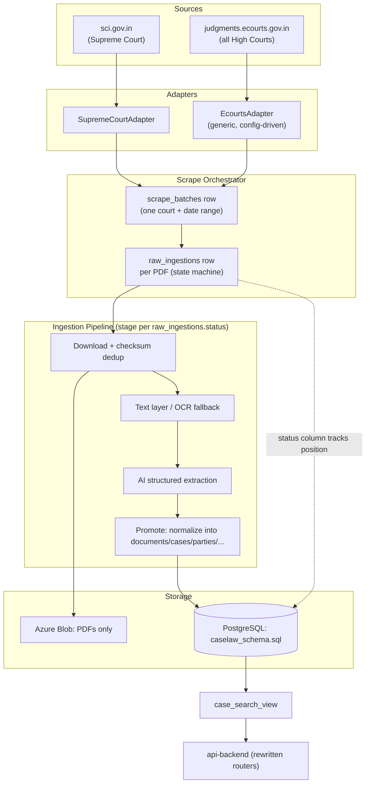

# scraper-backend Revamp — Full Rebuild Plan

Status: **Phase 0 + 1 + 2 + 3 + 4 DONE (2026-09-05)** — scraper-backend-v2 (schema, both adapters, orchestrator, full OCR/extraction/promotion pipeline) AND api-backend-v2 (filters/search/stats/history rewritten against the new schema) both built and verified, including genuine cross-service interop over the shared database. Additional decision made mid-build: api-backend's migration also followed the "new directory, old untouched" pattern (`api-backend-v2/`) rather than editing `api-backend/` in place, for consistency with scraper-backend-v2 — see the updated decisions list below. Three caveats carried forward: (1) neither scraper adapter's actual site-scraping logic has been network-verified (Phase 1/2 note in §8); (2) the LLM extraction call's actual output quality against a real judgment has not been verified — no live call was made to avoid spending the user's API credits without being asked (Phase 3 note in §8); (3) advocates are never populated (Phase 4 note in §8) since Phase 3's LLM extraction schema doesn't ask for them yet. Phase 5 (cutover) not started.
Owner: scraper-backend (new) + api-backend (shared Postgres only, no shared code)
Sources in scope: Supreme Court of India (sci.gov.in, public portal) + all High Courts (via the unified eCourts judgments portal, judgments.ecourts.gov.in)
Decisions locked in for this plan (confirmed with user 2026-09-05):
- Supreme Court source = **sci.gov.in**, not SCC Online. No commercial-site login/subscription flow needed.
- High Courts = **one generic eCourts adapter**, config-driven per court, replacing the 25 bespoke per-court scripts under `app/*_SCRAPER/`.
- Schema migration = **clean-break**. Adopt `caselaw_schema.sql` as the new production schema; update api-backend in the same effort. No dual-write/back-compat shim, since current data is dev-stage.
- **No shared code between services.** `api-backend` and the new scraper backend each keep a fully standalone copy of schema DDL, connection handling, and anything else — same independence philosophy as today's services, just with the schema content updated to `caselaw_schema.sql` in both copies. The §3.2 "shared `db` package" option considered in the first draft of this plan is **rejected** (confirmed with user 2026-09-05).
- **DB connection config is discrete env vars, never a connection-string key.** `DATABASE_TYPE`/`DB_HOST`/`DB_PORT`/`DB_NAME`/`DB_USER`/`DB_PASSWORD` only (matching `legal_liznr/legal_mvp/backend/.env`'s convention) — no `DATABASE_URL`/`DB_CONNECTION` variable, and `connection.py` never prefers one over the other since only one path exists. See §3.3.
- **Build the new service in a new directory; do not touch the current `scraper-backend/`.** The existing service keeps running untouched throughout the build. The new service is built at `legal-db/scraper-backend-v2/` from an empty slate — no code is ported by editing in place, no shared imports back to the old folder. Cutover (retiring the old folder, promoting the new one to the `scraper-backend` name) is a deliberate final step the user triggers once the new service is validated, not an automatic part of any phase below.
- **api-backend's migration follows the same "new directory, old untouched" pattern (confirmed with user 2026-09-05, Phase 4).** Originally §6 below assumed editing `api-backend/`'s router files in place — that assumption is superseded. `legal-db/api-backend-v2/` was built fresh instead, for consistency with the scraper-backend-v2 precedent; `legal-db/api-backend/` is untouched, same cutover discipline as scraper-backend/scraper-backend-v2.

---

## 1. Why a rebuild (not incremental patching)

Current state of `legal-db/scraper-backend`:

- **Only Supreme Court is actually wired end-to-end.** `scraper_pipeline.py` hardcodes `court_id == "SCIN"`; the 25 High Court scripts under `app/*_SCRAPER/` are standalone, produce local JSON files, and are never ingested into Postgres. `court_manager.py`'s dynamic-import routing exists but nothing calls it from the pipeline.
- **Schema duplication as a standing hazard.** `db_manager.py` is hand-copied between `scraper-backend` and `api-backend` ("kept in sync by hand" — literally the comment in both files). The schema itself is a flat `cases` table with UUID PKs, not the normalized document/case split needed for a judgment that disposes multiple case numbers (the exact problem `caselaw_schema.sql` § 4 solves with `documents` + `cases`).
- **Naive extraction.** Judge/act/party parsing is regex-heavy (`normalizer.py`, `pdf_metadata_extractor.py`); citation treatment classification is a keyword-proximity regex (`citator.py`) that will misfire on "overruled" appearing in an unrelated sentence. Only the case-note summary goes through an LLM call.
- **No real dedup key.** Dedup is done by matching `diary_number`/`case_number`/date strings across a JSON blob and a live DB query (`get_existing_cases_keys`) — fragile compared to a content checksum.
- **No resumability.** Job state lives in an in-memory `ACTIVE_JOBS` dict (`scraper_pipeline.py`); a process restart loses in-flight job tracking except for whatever was last flushed to `scraper_jobs.logs`.
- **Per-court scraper duplication.** Every High Court script (Delhi, Bombay, Kerala, ...) reimplements captcha solving, PDF capture, and session-timeout recovery from scratch even though they all hit the *same* eCourts portal (`judgments.ecourts.gov.in`) — see `delhi_high_court.py` for the pattern (state/bench dropdown → captcha → `#report_body` results → per-row PDF modal capture with session-timeout recovery). This is one adapter's worth of logic copy-pasted ~25 times with drift between copies.

`caselaw_schema.sql` (attached) is the target: enums for closed vocabularies, lookup tables for everything else, a `raw_ingestions` staging table that *is* the pipeline state machine (`QUEUED → DOWNLOADED → OCR_DONE → EXTRACTED → PROMOTED`/`NEEDS_REVIEW`), a `documents`/`cases` split, a real citation graph, and a `case_search_view` that pre-joins everything api-backend needs. The rebuild's job is to make the actual pipeline behave like that schema assumes.

---

## 2. Target Architecture



Key architectural shifts from today:

1. **`raw_ingestions` replaces the in-memory job dict.** Every scraped PDF becomes a row the moment it's found, with `status` moving through the enum. A crashed process resumes by querying `WHERE status = 'QUEUED'` etc. — no more losing progress on restart.
2. **Checksum-based dedup, not string-key matching.** `file_checksum` (sha256 of PDF bytes) is a `UNIQUE` constraint on `raw_ingestions`. A court re-listing the same judgment on a later scrape is a no-op insert, not a Python set lookup against three different string permutations.
3. **One eCourts adapter, N court configs.** The `courts` table already has an `ecourts_code` column — that's the state/bench selector value. High Court scraping becomes "for each row in `courts` where `court_type = 'High Court'`, run `EcourtsAdapter.scrape(court, date_range)`" instead of 25 separate Python files.
4. **AI extraction is one structured-output call per document, not regex + one LLM call for prose.** The LLM receives the OCR text and returns the *entire* case's structured fields (parties, judges, provisions, disposition, case note) in one schema-constrained response, stored verbatim in `raw_ingestions.raw_ai_extraction` (JSONB) before any normalization — so a bad normalizer bug never requires re-running OCR/LLM, only re-parsing the stored JSON (this is exactly why the schema comment on that column says "kept verbatim so you can re-parse without re-running OCR/LLM").
5. **Blob storage shrinks to PDFs only.** Bronze/Silver JSON-in-blob-with-merge-logic (`azure_blob.py`'s `upload_json_to_blob` merge dance) goes away — Postgres `raw_ingestions` is now the single source of truth for raw OCR text and raw AI output. Blob only stores the original PDF bytes (`raw_ingestions.blob_path`).
6. **api-backend queries the new schema via `case_search_view`.** Filter/search routers get rewritten against `documents`/`cases`/`parties`/`document_coram`/`citations`, using the view for the common joins instead of hand-rolled per-endpoint SQL against a flat table.

---

## 3. Database Layer

### 3.1 Adopt `caselaw_schema.sql` as-is, plus operational additions

The attached schema covers the domain model fully. It's missing only *operational* tables that don't belong in a "case law" schema but that the scraper needs — these get added as a supplementary migration on top of it, not a modification of it:

```sql
-- Supplementary to caselaw_schema.sql — scraper operational tables

CREATE TABLE court_scrape_config (
    court_id        BIGINT PRIMARY KEY REFERENCES courts(court_id),
    adapter         TEXT NOT NULL,              -- 'supreme_court' | 'ecourts'
    state_code      TEXT,                       -- eCourts state_code select value (e.g. '7~26' for Delhi)
    bench_code      TEXT,                       -- eCourts dist_code select value
    is_active       BOOLEAN NOT NULL DEFAULT TRUE,
    last_scraped_to DATE,                       -- watermark: resume from here on next run
    notes           TEXT
);

-- scrape_batches and raw_ingestions already exist in caselaw_schema.sql §3 — used directly, unchanged.
```

`court_scrape_config` is what turns "25 Python files" into "25 rows." Seeding it is a one-time data-entry task (state/bench codes are visible in each existing HC script's constants — e.g. `DELHI_STATE_CODE = "7~26"` in `delhi_high_court.py` — so seeding is mostly copy-out, not re-discovery).

**Operational gotcha worth knowing before manually deleting rows (found 2026-09-06 when the user hit it via TablePlus):** `documents.ingestion_id` and `raw_ingestions.document_id` form a genuine circular foreign key — neither has `ON DELETE CASCADE`, so `documents` can't be deleted while a `raw_ingestions` row points at it via `document_id`, and `raw_ingestions` can't be deleted while a `documents` row points back at it via `ingestion_id`. `python -m db.init_db init --drop` sidesteps this entirely (`DROP TABLE ... CASCADE` doesn't care about direction), but targeted row deletion needs the cycle broken first: `UPDATE raw_ingestions SET document_id = NULL WHERE ingestion_id = <id>;` before deleting the `documents` row, then the `raw_ingestions` row. `citations.cited_document_id` has the same non-cascading shape (deliberately — spec §5.3, a cited case may not exist yet) and needs the same treatment when deleting a document other rows might cite.

### 3.2 Standalone `db` module in each service — no shared package (decided)

Confirmed with the user: `api-backend` and the new scraper backend each keep a **full, independent copy** of the schema DDL and connection-handling code — no shared internal package, no cross-imports between the two service folders. This matches the current services' stated independence philosophy ("no shared code, ever") and the instruction to build the new scraper backend from an empty slate rather than wiring it to anything in the old tree.

The tradeoff this accepts: the two copies of `CREATE_TABLES_SQL`/`connection.py` must be **kept in sync by hand** across services whenever the schema changes — exactly the situation the old `db_manager.py` comments already describe today, just with `caselaw_schema.sql` as the new content being duplicated instead of the old flat schema. There's no tooling proposed to auto-sync them; treat any future schema change as "edit both copies" as a standing discipline, same as before.

### 3.3 Connection configuration: discrete env vars only, no connection-string key (decided)

Confirmed with the user, matching the convention already used in `legal_liznr/legal_mvp/backend/.env`: both services' `db/connection.py` build the connection from **discrete environment variables**, not a single pre-built connection-string variable.

```env
DATABASE_TYPE=postgres
DB_HOST=localhost
DB_PORT=5433
DB_NAME=liznrlegal
DB_USER=postgres
DB_PASSWORD=Root0133
```

`connection.py` reads these six variables and assembles the connection itself (e.g. `psycopg2.connect(host=..., port=..., dbname=..., user=..., password=...)` or an equivalent DSN built from the parts internally) — the connection string is never something set directly in `.env`.

This explicitly **removes** the pattern in today's `db_manager.py`'s `get_db_url()`, which prioritizes a full `DATABASE_URL`/`DB_CONNECTION` string over the discrete `LEGAL_CORPUS_DB_*` variables when both are present. The new `.env`/`.env.example` in both `scraper-backend-v2/` and `api-backend/` carry **only** the six discrete keys above — no `DATABASE_URL`, no `DB_CONNECTION`, no dual-path "prefer the URL if set" branching. One way to configure the connection, not two.

`DATABASE_TYPE` is carried through even though Postgres is the only backend in scope for this plan — it's config surface for a future non-Postgres target, not something `connection.py` branches on today beyond validating it equals `postgres`.

### 3.4 `case_search_view` becomes api-backend's primary read path

`filter_router.py` and `search_router.py` currently hand-write joins against `cases`/`parties`/`case_judges`/`provisions`/`citations` for every endpoint. Post-migration, `case_search_view` (already defined in the schema, § 7) covers the common shape (case + court + coram + petitioners/respondents/subjects). Search/filter endpoints query the view; only case-detail (which needs the fuller citation graph — `citations_made` and `cited_by`) drops to raw joins, same as today's `get_case_detail`.

---

## 4. Scraper Adapters

### 4.1 Common adapter interface

```
class ScraperAdapter(Protocol):
    def scrape(self, court: CourtConfig, date_from: date, date_to: date) -> Iterator[RawJudgmentRecord]:
        """Yields one record per judgment found, PDF already downloaded to a temp path
        with checksum computed, before any DB write happens."""
```

`RawJudgmentRecord` is a plain dataclass: `pdf_path`, `pdf_bytes_checksum`, `source_url`, `case_number_raw`, `party_name_raw`, `judge_raw`, `decision_date_raw`, plus whatever fields that portal exposes without extra clicks. Nothing about parties/judges gets *trusted* here — this is search-results-table scraping only; the AI extraction stage (§5) does the real structured parsing from the PDF text.

The orchestrator, not the adapter, is responsible for: creating the `scrape_batches` row, checking the checksum against `raw_ingestions.file_checksum` before persisting, inserting the `raw_ingestions` row, and uploading the PDF to blob. This keeps adapters dumb (scrape + download only) and all DB/blob logic in one place instead of scattered through scraper files like today (`supreme_court.py` currently calls `db_manager` and `azure_blob` directly mid-scrape).

### 4.2 Supreme Court adapter (sci.gov.in)

Written fresh in `scraper-backend-v2/adapters/supreme_court/`, against the new `ScraperAdapter` interface — using the existing `supreme_court.py` purely as a reference for what already works, not as code to copy or import:
- Keep: 30-day date-batching (site-enforced), `ddddocr`-based captcha solve with math-expression handling, stealth init script, table-row parsing.
- Change: stop writing to `db_manager`/`azure_blob` directly from inside the scraper — return records to the orchestrator instead.
- Change: dedup moves from `seen_keys` string-matching to checksum-after-download, computed by the orchestrator.
- Add: captcha solve failure after N retries should mark the *batch* (not silently return an empty list) so it surfaces as a retryable batch rather than a quiet gap in coverage.

### 4.3 Generic eCourts adapter (all High Courts)

Generalizes the flow already proven in `delhi_high_court.py`:

1. Navigate to `judgments.ecourts.gov.in/pdfsearch/`, solve initial search captcha (`#captcha_image` / `#captcha`).
2. Select `#state_code` = `court_scrape_config.state_code`, wait for bench options, select `#dist_code` = `court_scrape_config.bench_code` (falls back to first available bench if unset — matches current Delhi script behavior).
3. Set custom decision-date range (`#exampleRadios5`, `#from_date`/`#to_date`).
4. Run search, wait for `#report_body` rows.
5. Per row: parse case number/party/judge/CNR/dates out of the description text (regex patterns already validated in `parse_result_row`), then capture the PDF via the response-listener + modal-click pattern, with the session-timeout captcha recovery loop (`handle_session_timeout_captcha`) reused as-is — this part of the existing code is genuinely solid and portable.
6. Paginate via `#example_pdf_next` until exhausted.

The only per-court *inputs* are `state_code` and `bench_code` from `court_scrape_config` — everything else in the flow above is identical across High Courts because it's the same portal. This is the single highest-leverage simplification in this rebuild: ~25 files with duplicated captcha/session logic become one adapter class plus a config table.

**Risk to flag explicitly:** not verified yet whether every High Court's results-row HTML/description format is byte-identical to Delhi's (e.g. some benches may omit "Disposal Nature" or format CNR differently). Plan accounts for this with a "field extraction confidence" pass per court during rollout (§8, Phase 2) rather than assuming uniformity up front.

### 4.4 Orchestration & resumability

- `scrape_batches` row created per (court, date range) run.
- Each successfully-downloaded PDF → `raw_ingestions` row, `status = 'DOWNLOADED'`, `batch_id` set.
- A separate always-running (or cron-triggered) worker picks up `raw_ingestions WHERE status = 'DOWNLOADED'` for OCR, then `WHERE status = 'OCR_DONE'` for AI extraction, then `WHERE status = 'EXTRACTED'` for promotion into `documents`/`cases`. This decouples "scrape speed" from "LLM extraction speed" — a burst of 500 newly-found PDFs doesn't block the browser session waiting on LLM calls.
- `court_scrape_config.last_scraped_to` is the resume watermark for scheduled/incremental runs (e.g. nightly "scrape yesterday" jobs per court) — replaces manually re-specifying date ranges.

---

## 5. OCR & AI Extraction

### 5.1 Text extraction with real OCR fallback

Today: `PyMuPDF` (`fitz`) extracts text assuming a text layer exists; there's no actual OCR step despite the README calling this an "OCR engine" (the only OCR library in `requirements.txt`, `ddddocr`, is used solely for captcha-solving, not document text).

Plan: 
1. Try `PyMuPDF` text extraction first (fast, free, works for the majority of digitally-filed judgments).
2. If extracted text is empty/near-empty (scanned judgment — common for older High Court records), fall back to real OCR. Options to evaluate: Tesseract (free, self-hosted, lower accuracy on Indian-English legal documents with unusual fonts/stamps) vs. a cloud OCR API (higher accuracy, per-page cost). Given the schema's `ocr_engine` column already anticipates this exact choice ("'textract','tesseract','gpt-ocr' etc"), keep the engine pluggable and record which one ran per document.
3. `raw_ingestions.ocr_confidence` gets populated (page-level average if the engine reports it) and feeds `documents.needs_review` downstream.

### 5.2 Structured AI extraction (replaces the regex-extractor + single-field LLM call)

Today's `pdf_metadata_extractor.py` is ~1300 lines of regex heuristics (case-type maps, act-alias tables, subject/industry keyword lists, party-type inference) plus exactly one LLM call that only produces `case_note`. This is backwards for anything except the case note itself — an LLM reading the actual judgment text is much better positioned to extract "who are the parties," "which judges," "which sections were invoked" than a regex bank tuned to Supreme Court formatting conventions that may not hold for 25 different High Courts.

Plan: one LLM call per document, given the OCR text (or a curated set of section-snippet windows for very long judgments, reusing the existing `extract_section_snippets` windowing idea), with a JSON-schema-constrained response covering the *entire* `documents`/`cases` extraction surface:

```json
{
  "case_note_ai": "...",
  "cases": [{ "case_number": "...", "cnr_number": "...", "category_hint": "...", "parties": [...] }],
  "coram": [{ "name": "...", "is_author": true }],
  "provisions": [{ "statute_name": "...", "section_number": "..." }],
  "citations": [{ "cited_case_name": "...", "cited_reporter_citation": "...", "treatment": "Overruled|Affirmed|..." }],
  "disposition_category": "Allowed|Dismissed|...",
  "favoring_party_side": "PETITIONER_SIDE|RESPONDENT_SIDE|null"
}
```

Stored verbatim in `raw_ingestions.raw_ai_extraction` before any DB normalization — this is the schema's explicit intent for that column. The existing regex banks (act aliases, case-type maps) don't disappear entirely — they become a *normalization* layer downstream of the LLM (resolving "IPC" → the canonical `statutes` row), not the primary extraction mechanism. This is a much smaller, more maintainable use of the same lookup tables (`normalizer.py`'s `CANONICAL_ACTS_SEED` is reusable almost as-is for this purpose).

Confidence handling: if the LLM extraction fails schema validation or key fields (case number, judgment date) are missing, the row goes to `status = 'NEEDS_REVIEW'` rather than silently promoting with nulls (current `ingest_case_metadata` promotes regardless of how sparse the record is).

### 5.3 Citation treatment — keep regex as a pre-filter, not the classifier

`citator.py`'s reporter-citation regexes (SCC/AIR/SCR pattern matching) are still useful as a *candidate finder* — they're good at spotting "there's a citation here." What should change is treatment classification: instead of "closest keyword within 150 characters wins," treatment comes from the structured LLM extraction (§5.2's `citations[].treatment`) since the LLM has the surrounding paragraph's actual meaning, not just keyword proximity. The `citation_treatment_enum` in the schema already matches vocabulary a legal-domain LLM prompt can target directly (`Overruled`, `Affirmed`, `Distinguished`, `Followed`, `Referred`, `Relied Upon`, `Explained`, `Doubted`).

`citations.cited_document_id` resolution (matching a cited case's plain-text citation to an actual row in `documents`) stays a separate, periodic reconciliation job — run it after each ingestion batch, matching on `neutral_citation`/`equivalent_citations` overlap, same spirit as today's `recompute_all_treatment_statuses` but simplified since the new schema has no derived `treatment_status` column to keep in sync — treatment lives per-citation-edge in the graph, computed on read (or via a materialized view added later if query performance demands it) rather than written back onto `documents`.

---

## 6. api-backend Migration (clean-break)

Both services move to the new schema together:

- **`filter_router.py`**: rewrite `_compute_database_options()` per key against the new tables — `court` from `courts`, `judge` from `document_coram` + `judges`, `act` from `document_sections` + `sections` + `statutes`, `subject`/`industry` similarly via their junction tables. `filter_definitions`/`filter_options` (admin-configurable filter metadata) carry over unchanged — they're presentation config, not case data, and aren't part of `caselaw_schema.sql`'s domain, so they get added as another supplementary table alongside `court_scrape_config` (§3.1).
- **`search_router.py`**: `execute_case_search` rewritten against `case_search_view` for the list endpoint (it already has case/court/coram/parties/subjects joined); `get_case_detail` drops to raw joins across `documents`/`cases`/`parties`/`case_counsels`/`document_sections`/`citations` for the fuller detail payload, same shape as today's response models (`CaseDetail`, `CitationMade`, `CitedByItem`) — those Pydantic models barely change, only the SQL underneath them.
- **Full-text search**: today's search is `ILIKE '%term%'` trigram matching. The new schema has a maintained `tsvector` (`documents.search_vector`, trigger-populated, weighted A/B/D across case note / disposition / OCR text). Swap free-text search to `@@ plainto_tsquery('english', ...)` against that column — faster and rank-aware, replacing the current `OR ... ILIKE` chain across 12 parameters.
- No dual-write, no compatibility shim: both services are redeployed together against the new schema in one migration window, consistent with the "clean-break" decision. Old data does not need to survive the cutover (dev-stage volumes; the whole current dataset can be treated as disposable and re-scraped if needed, or migrated with a one-off script if the data's worth keeping — decide at cutover time based on actual row counts then).

---

## 7. What does NOT carry forward into the new service

Nothing here is deleted during the build — `scraper-backend/` stays untouched and running until the user explicitly decides to retire it post-cutover (§8, Phase 5). This section lists which of its patterns/approaches are simply not reproduced in `scraper-backend-v2/`, since the new service is written fresh rather than ported:

- The 25-files-under-`app/*_SCRAPER/` structure — one generic `EcourtsAdapter` replaces it (§4.3). Delhi's HTML/selector knowledge and the Supreme Court script's captcha-solving approach are read as reference while writing the new adapters, not copied in as files.
- `court_manager.py`'s dynamic-import-by-filename routing — replaced by `court_scrape_config` + one adapter dispatch.
- `citator.py`'s treatment-classification approach (keyword-proximity regex) — the new service's citation *finding* regexes may look similar as a pre-filter (§5.3), but classification comes from the LLM instead.
- `pdf_metadata_extractor.py`'s regex-bank extraction approach — replaced by the single structured LLM call (§5.2); only the alias/lookup *data* (canonical act names, etc.) is worth referencing when building the new normalization data.
- `azure_blob.py`'s JSON bronze/silver upload+merge approach (`upload_json_to_blob`'s merge-by-diary-number logic) — the new service's blob storage is PDFs only.
- The in-memory `ACTIVE_JOBS`/`ACTIVE_THREADS`/`CANCEL_FLAGS` job-tracking approach in `scraper_pipeline.py` — the new service uses `raw_ingestions`/`scrape_batches` status columns as the source of truth instead.
- The old flat-`cases`-table schema in `db_manager.py` — the new service's `db/schema.sql` is `caselaw_schema.sql` + the supplementary tables in §3.1, from day one.

---

## 8. Phased Delivery

**Phase 0 — Schema cutover — DONE (2026-09-05)**
Applied `caselaw_schema.sql` + supplementary tables (§3.1, §6) to a real local Postgres 15 instance (installed via Homebrew for verification only, since Docker wasn't available in the build environment — torn down after; the actual deployment path is `scraper-backend-v2/docker-compose.yml`'s own `db` service). Scaffolded `legal-db/scraper-backend-v2/` from an empty directory: `db/schema.sql`, `db/connection.py` (discrete env vars per §3.3), `db/init_db.py` (schema apply/reset CLI), `db/court_config.py` + `db/scrape_jobs.py` (query layers, no adapter dependency), a minimal `api.py` (health check that actually round-trips a query, not just a 200), and `routers/court_config_router.py`. All 26 tables + the view + all 5 triggers + all 7 enums applied cleanly via `python -m db.init_db init`; the FK forward-reference from `raw_ingestions` to `documents` resolved correctly; `--drop` clean-reinit verified. Full round-trip verified through the actual FastAPI app (not just raw SQL): insert courts → `GET /api/courts` → `PUT .../config` → confirm persisted, plus `scrape_jobs.py`'s checksum-based dedup (inserting the same `file_checksum` twice returns `None` the second time, as designed) and status-transition queries. Caught and fixed one real bug in the process: the original startup handler crashed the whole app if Postgres wasn't reachable yet, which made the graceful `/health` "degraded" status unreachable — startup failures are now non-fatal and logged instead. Every other endpoint's DB-unavailable path was also hardened to return a clean 503 instead of a raw stack trace. `api-backend`'s own standalone schema copy (Phase 4) not started yet. The old `scraper-backend/` was untouched throughout and needs no action.

**Phase 1 — Supreme Court pipeline, end-to-end — DONE (2026-09-05), one caveat below**
Built: `adapters/base.py` (`ScraperAdapter` protocol + `RawJudgmentRecord`), `adapters/supreme_court/adapter.py` + `captcha.py` (fresh, against sci.gov.in, informed by but not copied from the old `supreme_court.py`), `orchestrator/batch_runner.py` (checksum dedup via sha256, blob upload when Azure is configured, `scrape_batches`/`raw_ingestions` writes) + `job_registry.py` (status queries, no in-memory job dicts), `storage/azure_blob.py` (PDF-only), `pipeline/ocr.py` (PyMuPDF text-layer extraction), `pipeline/extraction.py` (a **Phase 1 stub**: reshapes the scraper's own parsed fields into the exact JSON envelope Phase 3's real LLM call will produce, so `promotion.py` never has to change when that swap happens), `pipeline/promotion.py` (writes `documents`/`cases`/`parties`/`document_coram`, routing to `NEEDS_REVIEW` instead of crashing when a required field like `judgment_date` is missing/unparseable), and `routers/scraper_router.py` (`/api/scraper/start|batches|status`).

Verified for real: a synthetic end-to-end test (`tests/manual_phase1_e2e.py`) generates an actual PDF with PyMuPDF, feeds it through a fake adapter and the real orchestrator against a live local Postgres, and confirms (a) OCR text extraction, stub extraction, and promotion produce correct `documents`/`cases`/`parties`/`document_coram` rows, (b) checksum dedup correctly no-ops a second run of the identical PDF, and (c) a record missing `judgment_date` routes to `NEEDS_REVIEW` rather than crashing the batch. The FastAPI endpoints were also verified against this live data.

**Caveat — NOT verified:** `adapters/supreme_court/adapter.py`'s actual scraping logic against the live sci.gov.in site (captcha solving, date-input selectors, results-table parsing, pagination) could not be exercised from the sandbox this was built in — no live network access to sci.gov.in. It follows the same approach the old service used successfully, rewritten fresh, but needs a real supervised dry run (`headless=False` via the `/api/scraper/start` payload) before it's trusted for an unattended scrape. This is the first thing to check before relying on Phase 1 in production.

**Phase 2 — Generic eCourts adapter + High Court rollout — DONE (2026-09-05), one caveat below**
Built: `adapters/ecourts/adapter.py` + `captcha.py` + `selectors.py` (fresh, config-driven by `state_code`/`bench_code`, generalized from the flow `delhi_high_court.py` demonstrated — nothing copied from it), `db/seed_courts.py` (seeds `courts` + `court_scrape_config` for the Supreme Court and all 25 High Courts, with `state_code` values read out of the old per-court scripts' `{COURT}_STATE_CODE` constants — a data-entry task, not a code port; `bench_code` left NULL for every court since none of the old scripts pinned one either, they all fell back to "first available bench"). `routers/scraper_router.py` was rewritten so `POST /api/scraper/start` only needs a `court_id` — it resolves the adapter class and `state_code`/`bench_code` from `court_scrape_config` itself, the same way a caller never needed to know which of the 25 old per-court scripts handled a given court.

Verified for real: `python -m db.seed_courts` against a live Postgres correctly seeds 26 courts (1 Supreme Court + 25 High Courts) and 25 `ecourts`-adapter `court_scrape_config` rows; `tests/manual_phase2_dispatch.py` confirms `POST /api/scraper/start` resolves the right adapter class per court_id (Supreme Court → `supreme_court`, Delhi → `ecourts` with `state_code='7~26'`), and that the error paths (unseeded court, inactive court, an `ecourts` court with no `state_code` configured) return clean 404/400s instead of crashing. The orchestrator/pipeline plumbing itself needed no new verification here — `EcourtsAdapter` conforms to the same `ScraperAdapter` protocol already proven end-to-end in Phase 1, so a bug at this layer would have to be adapter-specific, not orchestration-specific.

**Caveat — NOT verified, same as Phase 1:** `EcourtsAdapter`'s actual scraping logic against the live judgments.ecourts.gov.in portal (captcha solving, state/bench dropdown JS events, results-table parsing, the session-timeout-captcha recovery loop, PDF capture) could not be exercised from the sandbox this was built in. It follows the same approach `delhi_high_court.py` used successfully, generalized and rewritten fresh, but needs a real supervised dry run per court (`headless=False`) — starting with Delhi, since that's the one court the reference implementation actually proved — before an unattended multi-court rollout. The field-format-uniformity risk (§4.3: do all 25 High Courts' result rows parse the same way Delhi's did) is also still open and can only be resolved by that dry run, court by court.

**Phase 3 — Real OCR fallback + structured AI extraction — DONE (2026-09-05), two caveats below**
Built: `pipeline/ocr.py` extended with a Tesseract fallback (PyMuPDF renders each page to an image at 200 DPI when the text layer comes back under 20 characters, Tesseract reads the image, `ocr_engine`/`ocr_confidence` record which path ran). `pipeline/extraction.py` rewritten as the real structured-output LLM call (Groq, JSON-mode, one call per document, citation candidates from `pipeline/citator.py` included as prompt context) — a fresh design, not a port of `pdf_metadata_extractor.py`'s regex bank. The Phase 1 stub moved verbatim to `pipeline/extraction_stub.py` and is used as an explicit, logged fallback only when `GROQ_API_KEY` isn't configured — a failed LLM call (as opposed to a missing key) routes to `EXTRACTION_FAILED` instead of silently degrading to the stub, since that would hide a real production problem behind data that looks fine but isn't. `normalization/acts.py` + `judges.py` + `parties.py` built (act-alias resolution against the new `statutes` table shape, judge/party name cleaning) and wired into `pipeline/promotion.py`, which also gained provisions → `statutes`/`sections`/`document_sections` and citations → `citations` table writes, plus the `overruled_keyword_present` flag. `pipeline/citator.py` built: reporter-citation regexes survive as a candidate *finder* only (feeding the LLM prompt), never a classifier — treatment comes entirely from the LLM's `citations[].treatment` field now; `reconcile_citations()` resolves `citations.cited_document_id` as a separate periodic job since a cited case may not exist in the database yet at promotion time.

Two robustness gaps were caught and fixed while building this, not just noticed in review: (1) `promotion.py` was about to insert whatever string an LLM returned directly into three enum columns (`citations.treatment`, `documents.disposition_category`, `parties.party_side`) — Postgres has zero tolerance for an enum value that isn't an exact match, so a single slightly-off LLM response (`"overruled"` instead of `"Overruled"`) would have thrown an unhandled exception; added `_validate_enum()` to null out anything that doesn't exactly match instead of crashing. (2) That exception, had it happened, would have propagated all the way out of `orchestrator/batch_runner.py`'s per-record loop and aborted the *entire batch* — every record after the bad one would have been silently lost. Hardened `run_batch()` to catch exceptions per-record (both at the ingest step and the pipeline step), log them, mark that one row `EXTRACTION_FAILED`, and continue with the rest of the batch; a new `total_errored` counter in the batch summary surfaces this instead of hiding it.

Verified for real, not mocked, where the sandbox allowed it: a genuine image-only (no text layer) PDF was generated and pushed through `pipeline/ocr.py` — Tesseract actually read it, at a real confidence score, with the correct text recovered. Where a live call wasn't appropriate (see caveat below), `pipeline/extraction.py`'s request/response handling and `pipeline/promotion.py`'s consumption of the resulting envelope were verified with a mocked LLM response: provisions correctly resolved to canonical statute names, citations correctly stored, `needs_review` correctly `False` for an `llm_v1`-sourced document, and the bad-enum-values robustness fix confirmed by feeding deliberately invalid enum strings through promotion and confirming it still promotes successfully with just those fields nulled. Phases 1 and 2's existing tests were re-run against the Phase 3 code unchanged and still pass — no regressions, and the judge-name normalization improvement is visible even in the Phase 1 test's output (`HON'BLE MR. JUSTICE B.V. NAGARATHNA` now correctly cleans to `B.V. NAGARATHNA`, left raw in Phase 1).

**Caveat 1 — NOT live-verified:** the LLM extraction call's actual output quality against a real judgment (does the prompt reliably produce good case notes, correctly identify provisions, correctly classify citation treatment) was not tested with a real API call. General internet access is available from the build sandbox (unlike the sci.gov.in/eCourts sites), so this wasn't a network limitation — it was a deliberate choice not to spend the user's Groq API credits without being asked first. The request/response *plumbing* is verified (mocked); the *prompt quality* is not.

**Caveat 2 — cost/latency at volume, still unestimated:** one LLM call per judgment, at whatever volume Phase 2's High Court coverage produces, is a real ongoing cost and latency line item that hasn't been sized against actual judgment counts — flagged in the original plan as something to estimate before running this unattended at scale, still true now that the call itself exists.

**Fixes from the user's first live run against the real Supreme Court adapter (2026-09-05, after Phase 4 was already built):**

The user ran the actual scraper for real and hit two issues, both fixed:

1. **`GROQ_MODEL` had gone stale.** The `llama-3.3-70b-versatile` default (current as of when Phase 3 was built) started returning `404 Client Error` from `api.groq.com` — Groq returns 404 specifically for a model that no longer exists, not for auth problems, which is why this wasn't a `GROQ_API_KEY` issue. Fixed two ways: (a) `call_llm_extraction()` now logs the actual response body on a non-2xx response instead of just the bare status code, so the *next* stale-model incident is self-diagnosing instead of requiring a guess; (b) the fallback default was updated to `openai/gpt-oss-120b`, confirmed working against the user's real account (see below) — still fully overridable via `GROQ_MODEL`, since Groq's catalog will drift again.

2. **A real, previously-undetected bug: `orchestrator/batch_runner.py`'s `_run_pipeline_for_one()` chained OCR → extraction → promotion unconditionally**, even when an earlier stage had already failed. When the Groq call above failed, the row was correctly marked `EXTRACTION_FAILED` with a clear reason — but promotion then ran anyway against the resulting empty `raw_ai_extraction`, failed on the missing `judgment_date`, and **overwrote** the real error with a confusing `"judgment_date could not be parsed"` message that masked the actual root cause. This bug existed since Phase 1 but never surfaced in any of this rebuild's own testing, because Phase 1's stub extraction could never fail — it took a real extraction failure (only possible once Phase 3 added a real LLM call) plus a real user hitting it live to expose it. Fixed: each stage now checks the *previous* stage's actual resulting status before proceeding, stopping immediately (and preserving that stage's own error) if it didn't succeed. `run_batch()`'s summary counters were also corrected to bucket OCR/extraction failures under `total_errored` rather than the less alarming `total_needs_review`, which had been silently mischaracterizing them.

**Also revealed, as a side effect of debugging the above:** the `InsecureRequestWarning` for `api.sci.gov.in` in the user's logs confirms `adapters/supreme_court/adapter.py` is genuinely reaching the live site and downloading real PDFs — the first live evidence for the "NOT LIVE-VERIFIED" caveat on that adapter from Phase 1. Separately, a regression-test run after the fix above inadvertently made **one real call to the user's live Groq account** (confirming `openai/gpt-oss-120b` genuinely works) — this was a mistake, not a deliberate live-verification: `load_dotenv()` picked up the user's real, by-then-working `.env` credentials during a test that should have had `GROQ_API_KEY` explicitly blanked, the same discipline used throughout Phase 3's own verification. Disclosed to the user immediately; test commands now explicitly blank `GROQ_API_KEY` to prevent recurrence.

**Round 2 (still 2026-09-05/06): the `"judgment_date could not be parsed"` error persisted after the fixes above, on a genuinely different cause this time.** Debugging this properly required two more real fixes:

1. **No logging was configured anywhere in the service.** `api.py` never called `logging.basicConfig()`, so Python's root logger defaulted to `WARNING` — every `logger.info()` call across the whole service (batch progress in `batch_runner.py`, and any future diagnostic) was silently swallowed, not just this one. Fixed by adding `logging.basicConfig(level=logging.INFO, ...)` to `api.py`'s startup, and by adding a `PromotionSkipped` error message improvement (`pipeline/promotion.py`) that now includes the actual unparseable raw value (`repr()`'d) instead of a generic message — both changes exist specifically so the *next* mystery error is self-diagnosing from a single log line, without needing another back-and-forth to add temporary print statements.

2. **The real root cause, found from the resulting diagnostic output: sci.gov.in's results table has no separate date or citation column at all.** The three header names `adapters/supreme_court/adapter.py` originally guessed at (`"Order / Judgment By Date"`, `"Judgment Date"`, `"Date"`) — written without live access, per that module's own caveat — don't exist on the real site. The real headers, confirmed from the user's actual log output, are `['Serial Number', 'Diary Number', 'Case Number', 'Petitioner / Respondent', 'Petitioner/Respondent Advocate', 'Bench', 'Judgment By', 'Judgment']`. Both the decision date *and* the neutral citation are packed into one `"Judgment"` cell's text as e.g. `"05-01-2026(English) 2026 INSC 5(English)"` — two links' visible text concatenated by Playwright's `inner_text()`. Fixed by adding `_parse_judgment_cell()`, which regex-extracts both fields out of that combined string; verified directly against multiple real cell values from the user's own log (not synthetic data) before being considered fixed. `adapters/supreme_court/adapter.py`'s header comment was updated to reflect this as now partially live-verified, rather than still carrying the original "NOT LIVE-VERIFIED" caveat outright — captcha solving, results parsing, and PDF download are now confirmed working; a longer/higher-volume date range and older judgments' table layout are not yet checked.

One operational gap surfaced by this back-and-forth, not yet fixed: **there is no retry path for rows already sitting in a terminal failure status** (`NEEDS_REVIEW`/`EXTRACTION_FAILED`/`OCR_FAILED`). Checksum dedup treats "a `raw_ingestions` row already exists" as fully handled regardless of its status, so after a bug fix like the one above, previously-failed rows must be manually deleted before the same date range will be reprocessed — there's no built-in "retry failed rows" operation. Worth adding in Phase 5's operational-hardening pass, alongside the resumability/retry monitoring already planned there.

**Round 3 (still 2026-09-05/06), two more real bugs found from the user's own inspection of the live data, not from error messages this time:**

1. **`documents.data_source` (and `raw_ingestions.data_source`) were always `'ECOURTS'`, even for Supreme Court records.** Both columns have `DEFAULT 'ECOURTS'` in `caselaw_schema.sql`, and nothing in `db/scrape_jobs.py::insert_raw_ingestion()` or `pipeline/promotion.py`'s `documents` INSERT ever set the column explicitly — every source silently fell through to that default. The user noticed this by looking directly at the DB, not from any error. Fixed by making `data_source` a required parameter threaded all the way from `routers/scraper_router.py` (which maps `court_scrape_config.adapter` → `'supreme_court'`⇒`'SCI_WEBSITE'` / `'ecourts'`⇒`'ECOURTS'`) through `orchestrator/batch_runner.py::run_batch()` → `_ingest_one_record()` → `insert_raw_ingestion()`, and separately read back out of the `raw_ingestions` row (added to `get_ingestion()`'s SELECT) into the `documents` INSERT in `promotion.py`. Verified against real populated data across all three test courts (Supreme Court → `SCI_WEBSITE`, both High Courts → `ECOURTS`) — not just asserted, queried directly.

2. **`storage/azure_blob.py::upload_pdf()` silently swallowed every possible failure and returned `None`** — a missing `azure-storage-blob` package, a malformed connection string, a wrong container name, and a real network/auth failure all looked identical: a quiet `None`, `raw_ingestions.blob_path` ending up `NULL`, with zero indication which of those four things actually happened. This is the same "swallowed exception masks the real cause" shape as the Groq call and the date-parsing error earlier in this same debugging session — caught this time by the user asking why `blob_path` was null rather than by an explicit error, since there wasn't one to see. Fixed by giving each failure mode its own specific log line (missing package, malformed connection string, local file missing, and the actual upload call failing) instead of one blanket `except Exception: return None`. Verified directly: the missing-package path was reproduced for real (in a venv without `azure-storage-blob` installed) and confirmed to log the exact right message; the malformed-connection-string path was reproduced against the real Azure SDK and confirmed to surface its own underlying error text ("Connection string is either blank or malformed").

**Phase 4 — api-backend migration — DONE (2026-09-05), built as `api-backend-v2/` per the updated decision above**

Built as a fresh, standalone `legal-db/api-backend-v2/` (decision updated mid-phase, see top of doc) with its own copy of `db/schema.sql` — identical to scraper-backend-v2's through the domain model + shared operational supplement, with one deliberate divergence: `case_research_search_history` (per-user search history for legal-ui's case-research feature), split into its own `db/supplement.sql` specifically so it can be applied two ways — `python -m db.init_db init` for a fully standalone database, or `python -m db.init_db ensure-supplement` (idempotent, `IF NOT EXISTS` throughout) to add just that one table to a database scraper-backend-v2 already owns in a shared-DB deployment. This split was a real fix made mid-verification, not a decision made up front — see below.

`filter_router.py` and `search_router.py` rewritten against the new schema. Along the way, `case_search_view` (defined in the attached `caselaw_schema.sql`, §7) needed three additive columns beyond what it shipped with — `court_id` and `search_vector` (needed for filtering and full-text search, neither of which the view originally exposed) and a computed `treatment_status` column (spec §5.3's design: no stored column, computed via `EXISTS` against the `citations` graph, priority Overruled > Doubted > Distinguished > GOOD_LAW) — plus an `acts` aggregate column alongside the existing `coram`/`petitioners`/`respondents`/`subjects` ones, needed for the `act` filter facet. These were applied identically to both `scraper-backend-v2/db/schema.sql` and `api-backend-v2/db/schema.sql` to keep the two copies in sync, consistent with the view's own stated purpose ("convenience view for the API layer") rather than a change to the core domain model. Free-text search now uses `documents.search_vector @@ plainto_tsquery('english', ...)` for prose fields, kept alongside `ILIKE` for structured identifiers (case number, CNR, neutral citation) where ranking doesn't help — replacing the old 12-parameter `ILIKE` chain. `stats_router.py` and `history_router.py` (not analyzed in the original current-state audit, discovered while scoping this phase) were also ported — `history_router.py`'s logic is unchanged from the old service since it's independent of the case-law schema migration entirely, it just needed the new connection module and its own table.

**Two real bugs caught and fixed while verifying this, not just noticed in review:** (1) the `case_search_view` gaps above (missing `court_id`/`search_vector`/`acts`) were discovered only when the router code that needed them was actually written and it became clear the view couldn't support filtering/full-text search as originally shipped — fixed by extending the view rather than working around it in application code. (2) `case_research_search_history` was completely unreachable in a shared-DB deployment as originally designed (scraper-backend-v2 owns `init`, and its copy of `schema.sql` never included this api-backend-only table) — caught only by actually running the interop test end-to-end against a shared database and hitting a real `relation does not exist` error on `POST /api/cases/history`. Fixed by splitting the table into `db/supplement.sql` with its own idempotent `ensure-supplement` command, rather than guessing this would be fine from a read of the code.

**Verified for real, and this is the strongest verification in the whole rebuild so far:** three real documents (Supreme Court, Delhi HC, Bombay HC — different courts, different judges, one shared judge across two of them, real provisions, a real cross-document citation) were pushed through scraper-backend-v2's actual orchestrator and pipeline (`tests/populate_for_phase4.py`, mocked LLM call per Phase 3's existing caveat, everything downstream of that call is real) into a live Postgres database. `api-backend-v2` — a completely independent codebase sharing zero code with scraper-backend-v2 — then read that same data back through its own routers (`tests/manual_phase4_e2e.py`) and got every fact right: court/judge/act/treatment_status filter facets computed correct live counts (including the shared judge counted once per document across two courts, and act names resolved to their canonical statute names, not the raw strings the mocked LLM returned); full-text search found the right documents; filtering by act, judge, and computed treatment status all worked; `pipeline.citator.reconcile_citations()` (Phase 3, never previously exercised against a real cross-document citation) correctly linked the Delhi HC case's citation to the Supreme Court case's `document_id` by matching `neutral_citation`, making the Supreme Court case's computed `treatment_status` genuinely `OVERRULED` and its `cited_by` list correctly show the Delhi case as the source — while a citation to a case that was never promoted into the corpus correctly stayed unresolved (`cited_document_id: null`) rather than erroring. Search history round-tripped correctly once the supplement-table fix above was in place.

**Known gap, not a bug — advocates:** `case_counsels`/`advocates` are real tables in the schema and `get_case_detail` queries them correctly, but they come back empty for every case, because Phase 3's LLM extraction envelope (`pipeline/extraction.py`) never asks for advocate names. Fast-follow for whoever extends the extraction prompt next, not something Phase 4 needed to solve.

**Phase 5 — Cutover + operational hardening — NOT STARTED**
Once `scraper-backend-v2` and `api-backend-v2` are validated end-to-end against real data (Phases 1–4 — the interop test in Phase 4 is the strongest such validation so far, though see its live-scraping and LLM-quality caveats), retire the old `scraper-backend/` and `api-backend/` — the one point in the plan where either old directory is actually touched, and only as a final, deliberate, user-triggered step per service (rename/archive, then promote each `-v2` directory to the original name, or simply leave both directories as-is with the old one stopped — whichever the user prefers at the time, for each service independently). Decide and document which service owns `python -m db.init_db init` in the real shared-DB deployment (this doc assumes scraper-backend-v2, matching `db/schema.sql`'s header comment in both services, but that's a default worth confirming, not yet a confirmed decision). Add resumability/retry monitoring around `raw_ingestions` status transitions (e.g. an alert on rows stuck in one status past a time threshold — the schema's state-machine design makes this a simple query, not new infrastructure). Document the `court_scrape_config` seeding process for onboarding a not-yet-covered court in the future.

---

## 9. Folder Structure

Maps directly onto §4–§6: one directory per pipeline concept (adapters, orchestrator, pipeline stages, normalization, storage), instead of the current flat mix of `app/*_SCRAPER/` one-court-per-folder plus a handful of top-level modules (`citator.py`, `normalizer.py`, `ingestion.py`, `azure_blob.py`) that each did several unrelated jobs.

Built as a **new, standalone directory — `legal-db/scraper-backend-v2/`** — with zero imports into or out of the current `legal-db/scraper-backend/`, which stays untouched and running throughout the build. No shared package with `api-backend` either (§3.2, decided): every service carries its own complete copy of the DB layer.

```text
legal-db/
├── scraper-backend/                       # UNTOUCHED — current service, keeps running until cutover
│   └── ... (existing files, not modified by this plan)
│
├── scraper-backend-v2/                    # NEW — built from an empty slate, fully standalone
│   ├── api.py                             # FastAPI entrypoint
│   ├── Dockerfile
│   ├── docker-compose.yml                 # own Postgres instance, own port — never points at scraper-backend/'s containers
│   ├── requirements.txt
│   ├── .env / .env.example                # DATABASE_TYPE/DB_HOST/DB_PORT/DB_NAME/DB_USER/DB_PASSWORD only — no DATABASE_URL/DB_CONNECTION key (§3.3)
│   │
│   ├── adapters/                          # replaces app/*_SCRAPER/'s 25 folders -> 2, written fresh (not ported)
│   │   ├── base.py                        #   ScraperAdapter protocol + RawJudgmentRecord dataclass (§4.1)
│   │   ├── supreme_court/
│   │   │   ├── adapter.py                 #   sci.gov.in adapter, written fresh per §4.2 (old supreme_court.py used only as reference, not imported/copied)
│   │   │   └── captcha.py                 #   ddddocr + math-expression solving, sci.gov.in-specific
│   │   └── ecourts/
│   │       ├── adapter.py                 #   one generic adapter for all 25 HCs, written fresh per §4.3 (old delhi_high_court.py used only as reference)
│   │       ├── captcha.py                 #   captcha + session-timeout recovery
│   │       └── selectors.py               #   CSS selectors / onclick-parsing regexes for the eCourts portal
│   │
│   ├── orchestrator/                      # owns every scrape_batches/raw_ingestions write (§4.4)
│   │   ├── batch_runner.py                #   creates scrape_batches row, calls an adapter, checksum-dedups, uploads PDF to blob, inserts raw_ingestions rows
│   │   └── job_registry.py                #   status queries over raw_ingestions — no in-memory job-state dicts
│   │
│   ├── pipeline/                          # one module per raw_ingestions status transition, independently runnable
│   │   ├── ocr.py                         #   DOWNLOADED -> OCR_DONE: PyMuPDF text layer + Tesseract fallback (§5.1)
│   │   ├── extraction.py                  #   OCR_DONE -> EXTRACTED: the single structured-output LLM call (§5.2)
│   │   ├── extraction_stub.py             #   the Phase 1 stand-in, kept as a no-API-key dev fallback (extraction.py falls back to it, logged)
│   │   ├── promotion.py                   #   EXTRACTED -> PROMOTED: normalize raw_ai_extraction JSON into documents/cases/parties/document_sections/citations
│   │   └── citator.py                     #   citation-finding regex pre-filter + cited_document_id reconciliation job (§5.3)
│   │
│   ├── normalization/                     # post-LLM cleanup only — written fresh, informed by old normalizer.py's alias data
│   │   ├── acts.py                        #   canonical-act alias resolution (act-name -> canonical statutes row)
│   │   ├── judges.py                      #   judge name / honorific cleaning
│   │   └── parties.py                     #   party name cleaning
│   │
│   ├── storage/
│   │   └── azure_blob.py                  #   PDF upload only — no bronze/silver JSON merge logic
│   │
│   ├── db/                                # fully standalone — own schema DDL + connection code, no import from api-backend or old scraper-backend
│   │   ├── connection.py                  #   builds the connection from DATABASE_TYPE/DB_HOST/DB_PORT/DB_NAME/DB_USER/DB_PASSWORD (§3.3) — no connection-string env var
│   │   ├── schema.sql                     #   caselaw_schema.sql + court_scrape_config/filter_definitions supplement (§3.1)
│   │   ├── court_config.py                #   CRUD for court_scrape_config (state/bench code seeding)
│   │   ├── scrape_jobs.py                 #   CRUD/queries over scrape_batches + raw_ingestions
│   │   └── seed_courts.py                 #   one-time data-entry: seeds courts + court_scrape_config for SC + all 25 HCs (§8 Phase 2)
│   │
│   ├── routers/
│   │   ├── scraper_router.py              #   /api/scraper/start|status|jobs|cancel, rebuilt around raw_ingestions/scrape_batches
│   │   └── court_config_router.py         #   admin CRUD for court_scrape_config
│   │
│   ├── static/index.html
│   └── tests/
│       ├── adapters/
│       ├── pipeline/
│       └── orchestrator/
│
├── api-backend/                           # same top-level shape as today; routers rewritten per §6, DB layer stays standalone
│   ├── api.py
│   ├── routers/
│   │   ├── filter_router.py               #   rewritten against the new lookup tables
│   │   ├── search_router.py               #   rewritten against case_search_view + tsvector search
│   │   ├── history_router.py
│   │   └── stats_router.py
│   └── db/
│       ├── connection.py                  #   own copy, not imported from scraper-backend-v2 — same discrete-env-var contract (§3.3)
│       └── schema.sql                     #   own copy of the same DDL content — kept in sync by hand (§3.2)
│
└── docs/
    └── scraper-backend-revamp-spec.md
```

Old → new mapping, for anything not obvious from the tree above. "New" paths are all under `scraper-backend-v2/`; nothing in the old `scraper-backend/` is edited — these old files are reference material the new adapters/pipeline are informed by, not code that gets moved or imported:

| Old (`scraper-backend/`, untouched) | New (`scraper-backend-v2/`) | Why it moved |
|---|---|---|
| `app/*_SCRAPER/*.py` (25 folders) | `adapters/ecourts/adapter.py` (one file) | §4.3 — one portal, one adapter, config-driven |
| `app/SUPREME_COURT_OF_INDIA_SCRAPER/` | `adapters/supreme_court/` | Kept separate — different portal, different captcha style |
| `court_manager.py` | not carried forward | Dynamic filename-based routing replaced by `court_scrape_config` + adapter dispatch |
| `scraper_pipeline.py` | `orchestrator/batch_runner.py` + `orchestrator/job_registry.py` | Was doing both job-tracking and pipeline-orchestration in one file |
| `ingestion.py` | `pipeline/promotion.py` + `db/` queries | Ingestion logic now operates on `raw_ai_extraction` JSON, not raw scraper JSON |
| `citator.py` | `pipeline/citator.py` (finder) + `pipeline/extraction.py` (classifier, via LLM) | §5.3 — treatment classification moves off regex |
| `normalizer.py` | `normalization/` package | Alias data reused, code rewritten as post-LLM cleanup rather than primary extraction |
| `pdf_metadata_extractor.py` (per-court copies) | `pipeline/extraction.py` (one file, all courts) | §5.2 — one structured LLM call replaces the regex bank |
| `db_manager.py` | `db/connection.py` + `db/schema.sql` (own copy; `api-backend` keeps its own separate copy too) | §3.2 — standalone, no shared package |
| `db_manager.py`'s `get_db_url()` (prefers `DATABASE_URL`/`DB_CONNECTION` over discrete vars) | `db/connection.py` builds from `DATABASE_TYPE`/`DB_HOST`/`DB_PORT`/`DB_NAME`/`DB_USER`/`DB_PASSWORD` only | §3.3 — one configuration path, not two |
| `azure_blob.py`'s JSON bronze/silver functions | not carried forward | §7 — Postgres `raw_ingestions` is now the source of truth for raw text/AI output |

## 10. Open Risks (flagged, not resolved by this plan)

- **Captcha solver reliability at scale.** `ddddocr` is a general-purpose captcha OCR, not tuned per-site. It's already retried up to 50x per batch in the current code — worth measuring actual solve-rate per court during Phase 2 rollout; some High Courts may use harder captchas than Delhi's, and a low solve-rate silently caps how much of that court's docket is reachable.
- **eCourts session fragility.** The existing session-timeout-captcha-recovery logic in `delhi_high_court.py` suggests the portal itself is flaky under sustained use — worth confirming this generalizes cleanly rather than needing per-court tuning once tested against a second/third court.
- **HC results-row format uniformity** (§4.3) — not yet verified across courts beyond Delhi.
- **LLM cost/latency at full HC volume** — one structured-extraction call per judgment, times however many judgments exist across 25 High Courts' backlogs, is a real cost line item worth sizing once Phase 2 gives real per-court volume numbers.
- **Rate limiting / IP-ban risk** scraping government portals at higher throughput than the current ad-hoc single-threaded scripts — worth deciding on per-court request pacing and whether residential/rotating proxies are needed before Phase 2's full rollout, not after a court blocks the scraping IP.
